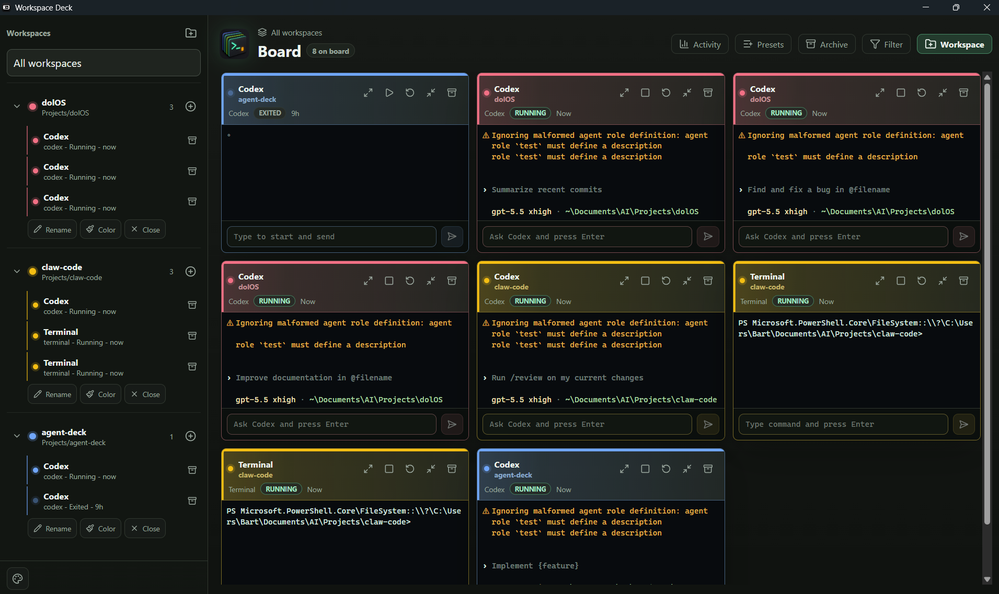

# Workspace Deck

<p align="center">
  
</p>

Workspace Deck is a lightweight, terminal-first desktop app for managing multiple local project workspaces from one focused board.

It is built for developers who regularly move between several repositories, command-line agents, dev servers, test runners, and shell sessions. Instead of spreading that work across many terminal windows and IDE panes, Workspace Deck keeps every active session visible, grouped by workspace, and ready to open as a full interactive terminal.

The app is local-first, Windows-first, and intentionally small in scope. It does not try to become an IDE, a Git client, a hosted agent platform, or an account manager. Its job is to make real terminal work easier to see, resume, and organize.

## What It Serves

Modern development work often happens across several long-running command-line contexts:

- A shell in the product repo.
- A Codex session in one workspace.
- A Claude session in another.
- A dev server, test runner, or custom command.
- Past terminal sessions that still contain useful context.

Workspace Deck turns those contexts into a single board. Workspaces own sessions, sessions show real terminal output, and the user can move from high-level monitoring to a focused terminal without losing track of where the work belongs.

## Current Features

- Multi-workspace sidebar for local project folders.
- Workspace accent colors that connect sidebar rows, session rows, tiles, and focused headers.
- Live terminal sessions backed by Tauri and `portable-pty`.
- Terminal rendering powered by `@xterm/xterm`.
- Board tiles that show real terminal output tails, not placeholder content.
- Focused terminal view for full interactive input, output, resize, stop, restart, archive, and delete flows.
- Session presets for Terminal, Codex, Claude, and Custom commands.
- Quick input directly from tiles, including Codex-oriented submit behavior.
- Workspace filtering across the board.
- Minimize-to-sidebar behavior for sessions that should stay available without taking board space.
- Activity, Presets, and Archive utility panels.
- Local JSON persistence for workspaces, sessions, presets, and session metadata.
- Transcript files for session history.
- Archived sessions that can be restored or deleted.
- Desktop image paste support from tile input: pasted images are saved as local attachments and inserted as usable file paths.
- Browser preview mode with mock terminal data for UI development.

## Why It Is Lightweight

Workspace Deck keeps the MVP centered on local terminal sessions:

- No cloud service is required.
- No remote daemon is required.
- No provider authentication is owned by the app.
- No Git, pull request, branch, clone, worktree, mobile, or orchestrator features are part of the MVP.
- Codex, Claude, and other CLIs authenticate inside their own terminal sessions.
- Project files stay in the user's local workspace folders.

This keeps the app fast to understand, easy to run, and focused on the daily workflow it is meant to improve.

## Architecture

- Frontend: React, Vite, TypeScript.
- Desktop shell: Tauri.
- Backend: Rust.
- Terminal engine: `portable-pty`.
- Terminal renderer: `@xterm/xterm`.
- Persistence: local JSON plus transcript files for the current MVP.

The active app lives at the repository root:

```text
src/
  app/
  domain/
  features/
  services/
  styles/
src-tauri/
  src/
    commands/
    core/
```

The archived legacy implementation is kept under `archive/legacy-agent-deck/` for reference only.

## Getting Started

Install dependencies:

```bash
npm install
```

Run the desktop app:

```bash
npm run tauri:dev
```

Run the browser preview:

```bash
npm run dev
```

Then open:

```text
http://127.0.0.1:1420/
```

The browser preview uses mock terminal data so the interface can be reviewed without Tauri. Real terminal processes run through the Tauri desktop app.

## Validation

Run the standard checks:

```bash
npm run typecheck
npm run build
cd src-tauri && cargo check
```

For terminal or process changes, also manually verify on Windows that a session can start, receive input, resize, and stop.

## Product Direction

The canonical MVP specification is maintained in:

```text
docs/terminal-board-clean-slate-spec.md
```

The guiding principle is simple: every feature should help the user manage multiple real project terminals from one calm, readable desktop interface.

## License

MIT. See `LICENSE`.
